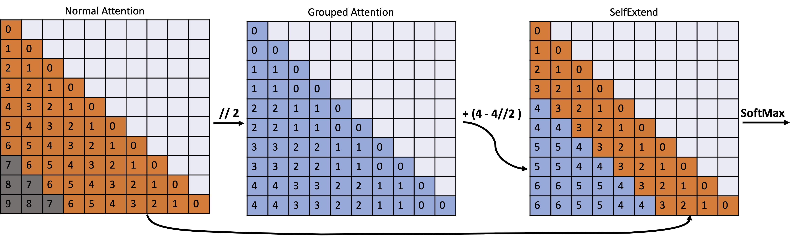

# LLM Maybe LongLM: Self-Extend LLM Context Window Without Tuning


Implementation of the proposed Self-Extend in [LLM Maybe LongLM: Self-Extend LLM Context Window Without Tuning](https://arxiv.org/pdf/2401.01325.pdf). 


## Updates
- [05/31/2024]:🎉 SelfExtend was highlighted in a Google I/O session at [YouTube](https://youtu.be/TV7qCk1dBWA?t=2025) to demonstrate the long-context ability of Gemma!!!
- [05/01/2024]:🎉 SelfExtend has been accepted by ICML 2024! See you in Vienna!
- [04/19/2024]:💡 We added the support for LLama-3 with transformers==4.40. To use it with transformers==4.40, you may change the file name of [Llama_4_40.py](./self_extend_patch/Llama_4_40.py) to ``Llama.py`` to replace the [existing patch file](./self_extend_patch/Llama.py). 
  - (Although, Llama-3's offical model hub recommends using transformers==4.40, we find that with transformers==4.38.2, Llama-3 can also work well)

- [04/06/2024]: We added some hyperparameters searching results with SelfExtend, you may check [here](#selfextend-on-needle-in-a-haystack)
- [03/24/2024]: We added [Triton](https://github.com/openai/triton) implemented flash self-extend. Now, you can use our [Triton implemented FlashSelfExtend](./self_extend_patch/selfextend_flash_attn_triton.py) to enjoy self-extend!
- [03/20/2024]: We do many updates:
  - We added the [FlashAttention](./self_extend_patch/selfextend_flash_attn.py) implementation of self-extend, credits to [Qingquan Song](https://qingquansong.github.io/)! This implementation uses the original flash_attn from Tri Dao. 
  - We also tried to implement [FlashAttention](./self_extend_patch/triton_self_extend_flash_attn.py) for self-extend using Triton. But currently, **it only works for the prefill stage, and cannot work well for the decoding stage.** We are eagerly debugging this. Any suggestions are very welcome!  
  - We added the support to Qwen1.5. Check the [codes](./self_extend_patch/Qwen2.py) for more details.
  - We reorganized this repo and refactored several files. Now, all codes run with **transformers==4.38.2 and flash_attn==2.5.6**. Legacy codes/examples/README are packed into [legacy_patch_before_4_38](./legacy_patch_before_4_38/). We recommend using our docker: [hoytjin/selfextend_docker:v0.1](https://hub.docker.com/r/hoytjin/selfextend_docker/tags) to avoid any environmental issues. 
  - We updated the api, now you can simply call `SelfExtend.apply(loaded model, group size, window size)` to enjoy our self-extend! Check and run the provided [example](./example.py) for more details! 
  - We add a new passkey example with 32k context length and a more challenging 10-digit passkey. 
  - Please join our [Discord](https://discord.gg/hGZSeH8h) for discussion! 🔥🔥 
- [02/22/2024]: We added the [Implementation for Google New LLM Gemma](https://github.com/datamllab/LongLM/blob/master/gemma_self_extend_patch.py)!!! Welcome to try and test it out!!
- [01/19/2024]: We've added the [implementation for Llama with transformers 4.36.2](https://github.com/datamllab/LongLM/blob/master/llama_self_extend_patch_4_36.py) and the [implementation for Microsoft's official phi-2 with transformers 4.37](https://github.com/datamllab/LongLM/blob/master/phi_self_extend_patch_4_37.py). Another good news: the flash attention version will come in days!💥
- [01/11/2024]: We've tested the implementation for phi-2. [It works](./img/phi2_long_bench.jpg). You may find some results on this [Reddit post](https://www.reddit.com/r/LocalLLaMA/comments/194mmki/selfextend_works_for_phi2_now_looks_good/?utm_source=share&utm_medium=web2x&context=3) and details on this [X post](https://x.com/serendip410/status/1745668085711790553?s=20)
- [01/08/2024]: Add third-party implementations section
- [01/07/2024]: Add Implementation for Mistral
- [01/05/2024]: Our proposed method is discussed on this [Reddit post](https://www.reddit.com/r/LocalLLaMA/s/IFOnL7yGNK) 


## Possible issues unrelated to Self-Extend:
- Gemma-7b has to be loaded in bfloat16. But Gemma-2b still works well with float16.
- If using transformers 4.36, the default attention used by Llama is `LlamaSpdaAttention` rather than `LlamaSpdaAttention`. Be careful about this and make sure you replace the forward method with the correct class.
- Mistral's sliding window should be disabled to use Self-Extend. The reason of why we should not use SWA can be found in our paper.  

## Third-party Implementations

**Llama.cpp** [https://github.com/ggerganov/llama.cpp](https://github.com/ggerganov/llama.cpp/blob/1fc2f265ff9377a37fd2c61eae9cd813a3491bea/examples/main/main.cpp#L552)

Llama.cpp has a great implementation and integration for self-extend! Have a try! 😄


## 1. Overview 
This work elicits LLMs' inherent ability to handle long contexts without fine-tuning. The limited length of the training sequence during training may limit the application of Large Language Models (LLMs) on long input sequences for inference. In this work, we argue that existing LLMs themselves have inherent capabilities for handling long contexts. Based on this argument, we suggest extending LLMs' context window by themselves to fully utilize their inherent ability. We propose Self-Extend to stimulate LLMs' long context handling potential. The basic idea is to construct bi-level attention information: the group level and the neighbor level. The two levels are computed by the original model's self-attention, which means the proposed does not require any training.

<p align="center">



## 2. How to Use SelfExtend

### 2.1 Setup

For current Llama Implementation, the python packages used are:
```bash
transformers==4.38.2
flash_attn==2.5.6 
```

We recommend to use this docker: [hoytjin/selfextend_docker:v0.1](https://hub.docker.com/r/hoytjin/selfextend_docker/tags)

We provided patches for several models before. You may check [legacy_patch_before_4_38](./legacy_patch_before_4_38/). It contains legacy patches (llama, mistral, phi..etc) and README.

### Installation

Clone the repository to your machine and copy your modeling files into the cloned repo directory.

### 2.2 Run
```python
import SelfExtend

# Load your model, e.g., loaded_model = AutoModelForCausalLM.from_pretrained(model_path) 

# group size, neighbor window. 

SelfExtend.apply(loaded_model, group_size, window_size, enable_flash_attention=False)

# Inference, e.g., loaded_model.generate(...)

```
enable_flash_attention=False by default, you may set enable_flash_attention=True, if the model is loaed with FlashAttention enabled. 

We use passkeyretrieval as an example to show how to use self-extend. You may check [example.py](./example.py):

```bash
python example.py

```
## 3.How to choose the group_size and neighbor_window

The following thoughts are based on our experience:

- With Llama-2 as the base model, **2\~64** are reasonable for group_size; **512\~1536** are feasible for neighbor_window. But larger group_size and smaller neighbor_window are also good in many cases. 

- The general rule of choosing group_size and neighbor_window is: ensure the input sequence lenght is within the maximum extended window size (For llama-2, it would be (4096 - neighbor_window) * group_size + neighbor_window ). 

- We didn't choose the group size carefully. For the same sequence, smaller group should be better. But we found this does not strictly hold in some experiments: 
  > Sometimes, a larger group size can be beneficial. This may be due to the fact that larger positions are not well-trained. A larger group size can utilize smaller positions, which have received more training, to facilitate extension. However, smaller group sizes tend to have better precision. Thus, there is a trade-off. For more details, refer to the ablation study section. <br><br>For example:<br>If the input length for a QA task is 15,800, with a neighbor window set to 1,024, the group size can be set to 5. This is because 5 * (4,096 - 1,024) + 1,024 equals 16,384, which is greater than 15,800. However, setting the group size to 6, or even larger, such as 8 or 16, might improve the model's performance. With a group size of 5, Self-Extend uses positions 1,025 to 3,979 to extend the context window. If the group size is set to 8, Self-Extend uses positions 1,025 to 2,871 for extension. Although a group size of 8 is less precise than a group size of 5, the positions 2,872 to 3,979, utilized by a group size of 5, are less trained during pretraining, which may affect the effectiveness of the extension.

- Maybe, for a sequence of length L, you can try the smallest group size first [calculated by: G * (L- w_n) + w_n] , and then test whether larger group can be better.

#### SelfExtend on 'Needle in a Haystack'
<p align="center">

<p align="center">


#### Emperical Rule:
Denoting the pretraining context window as $L$, the target extension length as $N$, the neighbor window as $W$, and the group size as $G$, the empirical rule for selecting hyperparameters is to ensure that the following inequality holds: $(\frac{1}{2} \sim \frac{2}{3}) \times L > W + \frac{N-W}{G}$ This is empirical, we believe it's due the fact that: large relative positions are not well trained. Empirically, only a portion($\frac{1}{2} \sim \frac{2}{3}$) of positions are well trained and SelfExtend should only leverage these well-trained relative position for extension. This finding explains:
Excessively small group sizes can degrade performance, as they provide precise position information but require SelfExtend to utilize less well-trained relative positions for extension.
Excessively large neighbor window sizes can also degrade performance, as they provide more neighbor information but necessitate the use of less well-trained relative positions for extension.
The experimental results indicate that SelfExtend is not overly sensitive to hyperparameter selection. Predefined, heuristic values for group size and neighbor window size are often sufficient to achieve satisfactory performance.

**[TLDR]**
 SelfExtend is not overly sensitive to hyperparameter selection. One could use a representative task to find proper hyperparameters. Or direcly follow our empirical inequality: $(\frac{1}{2} \sim \frac{2}{3}) \times L > W + \frac{N-W}{G}$


------


If you find our method useful, please kindly cite our paper.
```bibtex
@misc{jin2024llm,
      title={LLM Maybe LongLM: Self-Extend LLM Context Window Without Tuning}, 
      author={Hongye Jin and Xiaotian Han and Jingfeng Yang and Zhimeng Jiang and Zirui Liu and Chia-Yuan Chang and Huiyuan Chen and Xia Hu},
      year={2024},
      eprint={2401.01325},
      archivePrefix={arXiv},
      primaryClass={cs.CL}
}
```


## 4. Contributing
We welcome contributions from the research community to improve the effeicency of SelfExtend. If you have any idea or would like to report a bug, please open an issue or submit a pull request.

## 5. License
The code is released under the MIT License.

